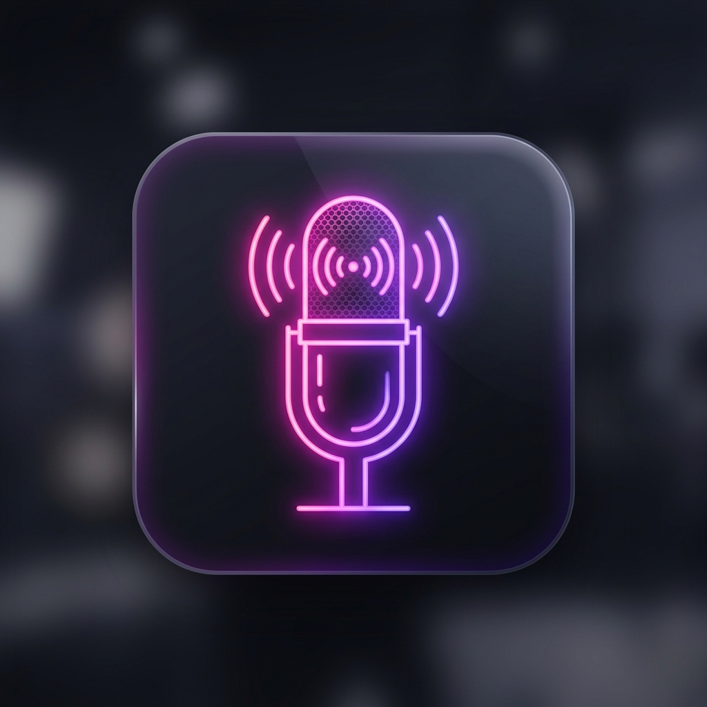

# 🎤 Smiley Studio (v1.0.0)

A high-performance, mobile-first **Pro Vocal Recording, Video Reel & Pitch Trainer Progressive Web App (PWA)** — designed with love for singer **Smiley** 💖



---

## 🌐 Live App & Repository

| | Link |
|---|---|
| 🚀 **Live App** | [https://r2dapps.github.io/SmileyStudio/](https://r2dapps.github.io/SmileyStudio/) |
| 📂 **GitHub Repo** | [https://github.com/r2dapps/SmileyStudio](https://github.com/r2dapps/SmileyStudio) |

---

## ✨ Feature Overview

### 🎙️ Audio Studio Mode
- **One-tap Vocal Recording** with real-time oscilloscope waveform visualizer
- **Live Ear Monitor** — hear your processed voice through headphones while singing
- **Pitch Detection** — live note readout (e.g. `A4`, `C5`, `F#3`) using autocorrelation
- **Hardware Noise Suppression** — echoCancellation, noiseSuppression, autoGainControl

### 🎛️ FX Rack — DSP Vocal Chain
Full Web Audio API signal chain with real-time sliders:

| Effect | Control |
|---|---|
| Mic Gain Boost | Input gain multiplier |
| Noise Gate | Hiss & bleed suppressor |
| Tube Saturation | Analog harmonic warmth |
| Stereo Chorus | Voice doubling & depth |
| Echo Delay | Feedback delay circuit |
| Concert Reverb | Spatial convolver reverb |

**Preset Voice Templates:**
- 🎙 Pop Lead Polish
- 🔥 Acoustic Warmth
- 🪄 Pitch Snap Assist
- 🎧 Lo-Fi Vibe
- 📻 Vintage Radio
- 🎚 Raw Dry Voice
- ➕ Save your own Custom Template presets

### 🎥 Video Reel Mode (Instagram / TikTok)
- **Live camera viewfinder** with real-time visual filters
- **Aspect Ratio Selector:** `Reel 9:16` · `1:1` · `4:5` · `16:9`
- **Front/Rear camera switching** via `SwitchCamera` icon
- **Selfie mirror** — front camera auto-mirrors video feed (`scaleX(-1)`)
- **Mirror badge** indicator when selfie camera is active
- **Clean View toggle** — hide all UI overlays for a clean viewfinder

**Realtime Video Filters:**
- 💖 Neon Pink Glow
- 🎞️ Vintage Warm Film
- 🌈 Vivid Color Boost
- 🖤 Black & White
- 🌙 Dream Soft Blur
- 🔵 Cyberpunk Cool

**Video Performance Recording:**
- Combined camera + processed audio captured in MP4 format
- Saves `aspectRatio`, `cameraFacing`, `filterName`, and `presetName` to metadata
- Stored locally in IndexedDB — fully offline

### 🎵 My Songs — Song Library
- **Audio Takes** — play, share as WAV, download as WAV
- **Video Reels** — play with correct aspect ratio (portrait/landscape), share as MP4, download as MP4
- **Aspect-ratio aware player** — portrait `9:16`/`4:5` reels display in a centered narrow player; landscape `16:9` goes full-width
- **Mirror playback** — selfie recordings play back with the mirror preserved
- **Per-recording metadata badges** — ratio · camera · filter · preset · duration
- **Backup** — export full song library as `.json`
- **Toast notifications** on share/download

### 🎹 Practice Tools
- **Chromatic Tuner** — needle gauge with cents deviation, note name, and target frequency
- **Metronome** — 40–240 BPM with visual beat pulse and audible click

### 🎚️ Tracks — Backing Track Player
- Upload local backing tracks (MP3/WAV/OGG)
- Adjust backing track vs. vocal volume mix
- Loop and scrub controls

---

## 🎨 Themes & Customization

### 8 Built-in Glowing Themes
| Theme | Accent |
|---|---|
| Neon Pink | `#ec4899` |
| Cyber Blue | `#38bdf8` |
| Emerald Stage | `#34d399` |
| Amber Sunset | `#fbbf24` |
| Midnight Purple | `#a855f7` |
| Rose Gold | `#fb7185` |
| Ocean Deep | `#06b6d4` |
| Crimson Fire | `#ef4444` |

### Custom Theme Builder
- Pick **Accent**, **Secondary**, and **Background** colors via native color pickers
- **Live preview strip** shows gradient in real time
- **Save as Named Template** — persisted to `localStorage`
- Saved templates appear as cards with glow border and delete button
- All theme colors driven by CSS variables (`var(--accent)`, `var(--accent-secondary)`, `var(--bg-main)`)

---

## 📱 PWA & Mobile Features

- **Installable PWA** — "Add to Home Screen" via Settings → Install App on Phone
- **Offline-first** — all recordings stored in IndexedDB, app cached via Service Worker
- **Portrait orientation lock** — prevents accidental rotation
- **Responsive layout** — full-screen on mobile, centered card on tablet/desktop
- **Theme-aware bottom nav** — active tab glow matches selected theme
- **App Update Check** — Settings → Check Update triggers SW update

---

## 🏗️ Tech Stack

| Layer | Technology |
|---|---|
| Framework | React 18 + TypeScript |
| Build tool | Vite 5 |
| Styling | Tailwind CSS v3 + CSS Variables |
| Audio Engine | Web Audio API (custom DSP chain) |
| Storage | IndexedDB via custom schema |
| Camera | MediaDevices + MediaRecorder API |
| Icons | Lucide React |
| State | Zustand |
| Routing | React Router v6 (HashRouter) |
| Hosting | GitHub Pages (`gh-pages`) |

---

## 💻 Local Development

```bash
# Clone repository
git clone https://github.com/r2dapps/SmileyStudio.git
cd SmileyStudio

# Install dependencies
npm install

# Start local dev server (hot reload)
npm run dev

# Type check (lint)
npx tsc --noEmit

# Build for production
npm run build

# Deploy to GitHub Pages
npm run deploy
```

---

## 📁 Project Structure

```
src/
├── app/              # App root, router, HashRouter
├── audio/
│   ├── engine.ts     # Web Audio API DSP engine
│   ├── pitch/        # Autocorrelation pitch detector & tuner
│   ├── effects/      # EQ, reverb, chorus, delay, gate, saturation
│   └── recorder/     # AudioRecorder, VideoRecorder, ExportManager (WAV/MP4)
├── components/       # Header, BottomNav, PWAInstaller, WaveformCanvas
├── core/             # StudioController (state machine + theme engine)
├── db/               # IndexedDB schema, recordings repo, blob storage
├── pages/            # StudioPage, FxPage, TracksPage, VaultPage, PracticePage, SettingsPage
├── store/            # Zustand store (useStudioStore)
├── styles/           # globals.css (8 themes + custom theme CSS vars)
└── utils/            # audioFeedback, videoFilters, capabilities, wakeLock
public/
├── manifest.json     # PWA manifest
├── sw.js             # Service worker (cache-first)
└── icon-*.png        # App icons
```

---

## 🎁 Made for Smiley

> *"A complete professional vocal studio in your pocket — record, mix, create video reels, and share your music with the world."*

Built with ❤️ using React 18, Vite, Web Audio API, and IndexedDB.

---

*Smiley Studio v1.0.0 · © 2024 R2D Apps*
